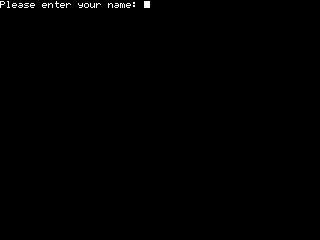
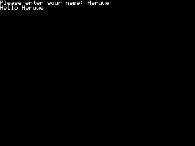
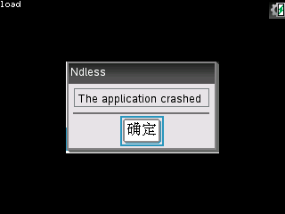

## 20160105

### `nspireio/nspireio.h`库的基本使用
1. 作为C库，在include的时候必须用`extern "C"`    
    ``` C++
    extern "C" {
        #include <nspireio/nspireio.h>
    }

    ```
2. 直接使用`nio_console csl;`定义一个console，__必须先使用`nio_init`初始化__它才能进行其他操作，否则计算器直接重启。
    ``` C++
    nio_console csl;
    nio_init(&csl, NIO_MAX_COLS, NIO_MAX_ROWS, 0, 0, BLACK, WHITE, TRUE);

    ```
3. `nio_set_default(&csl);`可以将csl设置为默认控制台，这样就可以直接使用不带`&csl`参数的函数了。
    ``` C++
    nio_printf("Please enter your name: ");
    char name[30];
    nio_scanf("%s", name);
    nio_printf("Hello %s\n", name);

    ```
4. 在需要用户输入时，控制台会显示一个闪烁的光标    
        
   在不需要用户输入时，光标不会显示    
        
5. 一般来说，对于控制台程序，需要在它结束的时候让用户使用任意键退出，而不是马上退出，否则用户会看不到最后的结果，可以使用`wait_key_pressed();`来实现“按任意键退出”。    
6. 在控制台程序结束，或者它不再会被使用时，应该调用`nio_free(&csl);`来释放资源。    
7. 这样，一个简单的控制台程序就写好了。
    ``` C++
    #include <libndls.h>

    extern "C" {
        #include <nspireio/nspireio.h>
    }

    int main(void) {
        assert_ndless_rev(801);
        nio_console csl;
        nio_init(&csl, NIO_MAX_COLS, NIO_MAX_ROWS, 0, 0, BLACK, WHITE, TRUE);
        nio_set_default(&csl);
        nio_printf("Please enter your name: ");
        char name[30];
        nio_scanf("%s", name);
        nio_printf("Hello %s\n", name);
        wait_key_pressed();
        nio_free(&csl);
        return 0;
    }

    ```
8. 控制台状态的存储与恢复    
    + 使用`nio_save`函数来存储控制台当前状态到文件里，使用`nio_load`以从一个文件里加载控制台状态。
        ``` C++
        void nio_save(const char* path, const nio_console* c);
        void nio_load(const char* path, nio_console* c);

        ```
    + 在`nio_load`中，如果第二个参数就是当前控制台，并且这个控制台的`drawing_enabled`是`TRUE`，那么变化会直接在屏幕上体现出来。    
    + 在`nio_save`中，如果文件存在，则会被覆盖，如果文件不存在，则会被创建；__在`nio_load`中，如果文件不存在，那么程序会崩溃__。    
    
    + 实例：在控制台中输入`save`来存储当前控制台，输入`load`来恢复控制台，输入`exit`退出程序。
        ``` C++
        #include <libndls.h>
        #include <string.h>

        extern "C" {
            #include <nspireio/nspireio.h>
        }

        int main(void) {
            assert_ndless_rev(801);
            nio_console csl;
            nio_init(&csl, NIO_MAX_COLS, NIO_MAX_ROWS, 0, 0, BLACK, WHITE, TRUE);
            nio_set_default(&csl);
            while (true) {
                char command[30];
                nio_scanf("%s", command);
                if (strcmp(command, "exit") == 0) break;
                else if (strcmp(command, "save") == 0) nio_save("./console_save.tns", &csl);
                else if (strcmp(command, "load") == 0) nio_load("./console_save.tns", &csl);
            }
            nio_free(&csl);
            return 0;
        }

        ```


### 按键扫描
1. `nio__getch()`函数 - 等待用户按下某个按键，一旦用户按下某个按键，函数就会立即返回这个按键对应的值（一般是ASCII）。    
    + 比较特殊的：`touchpad-up`-128, `touchpad-down`-129, `esc`-130, `tab`-9, `del`-8, `×`-`*`-42, `÷`-`/`-47, `(-)`-`-`-45, `enter`-`↵`-10, `EE`-38, `,`-44, `?!`-63     
    + 不被支持的：`on`, `touchpad-left`, `touchpad-right`, `touchpad-center`, `pad`, `doc`, `menu`, `ctrl`, `shift`, `val`, `trig`, `x^2`, `templet`, `catalog`, `π`, `ime-flag`    

2. `isKeyPressed()`函数 - 如果用户按了指定的键，则返回`TRUE`。    
    + 函数原型 `BOOL isKeyPressed(const t_key *key);`    
    + 参数可以使用`keys.h`定义的常量，`keys.h`已经包含在了项目默认引用的`libndls.h`中。    
    + 与`nio__getch()`不同的是，函数并不会阻断程序的执行，返回的值仅代表语句执行的同时用户是否按下这个按键，一般来说，会使用一个循环，就像这样    
        ``` C++
        while (!isKeyPressed(KEY_NSPIRE_Q));
        nio_printf("You pressed [Q]\n");

        ```
    + 同时监听多个按键    
        ``` C++
        while (!isKeyPressed(KEY_NSPIRE_ESC)) {
            if (isKeyPressed(KEY_NSPIRE_PLUS))
                nio_printf("You pressed [+]\n");
            else if (isKeyPressed(KEY_NSPIRE_MINUS))
                nio_printf("You pressed [-]\n");
            else if (isKeyPressed(KEY_NSPIRE_MULTIPLY))
                nio_printf("You pressed [*]\n");
            else if (isKeyPressed(KEY_NSPIRE_DIVIDE))
                nio_printf("You pressed [/]\n");
        }

        ```
      \*注意，用户按下一次键的同时，__循环会执行很多次__。为了避免执行次数过多，可使用`wait_no_key_pressed()`函数，直到用户放开按键时才开始下一轮循环，由于`wait_no_key_pressed()`函数本身需要一些时间执行，另外并不希望无关按键影响判断，因此只有用户按下键之后才能设置。类似地，也可以使用[`sleep()`](#使用sleep函数设置延时)函数设置一个延时，同样只有当用户按下被监听键时才能设置。
        ``` C++
        while (!isKeyPressed(KEY_NSPIRE_ESC)) {
            if (isKeyPressed(KEY_NSPIRE_PLUS))
                nio_printf("You pressed [+]\n");
            else if (isKeyPressed(KEY_NSPIRE_MINUS))
                nio_printf("You pressed [-]\n");
            else if (isKeyPressed(KEY_NSPIRE_MULTIPLY))
                nio_printf("You pressed [*]\n");
            else if (isKeyPressed(KEY_NSPIRE_DIVIDE))
                nio_printf("You pressed [/]\n");
            else continue;  //用户未按下被监听的键则 continue
            wait_no_key_pressed();  //用户按下了被监听的键则等待用户松开它
        }

        ```

### TouchPad 扫描
1. 与按键扫描类似，`isKeyPressed()`函数同样可以用来监听 TouchPad ， Ndless 把 TouchPad 分成了 9 个区域。    

    | `KEY_NSPIRE_LEFTUP`   | `KEY_NSPIRE_UP`     | `KEY_NSPIRE_UPRIGHT`    |
    |-----------------------|---------------------|-------------------------|
    | `KEY_NSPIRE_LEFT`     | `KEY_NSPIRE_CLICK`  | `KEY_NSPIRE_RIGHT`      |
    | `KEY_NSPIRE_DOWNLEFT` | `KEY_NSPIRE_DOWN`   | `KEY_NSPIRE_RIGHTDOWN`  |

    使用与按键扫描类似的代码来监听它们
    ``` C++
    while (!isKeyPressed(KEY_NSPIRE_ESC)) {
        if (isKeyPressed(KEY_NSPIRE_LEFTUP))
            nio_printf("You pressed [LEFTUP]\n");
        else if (isKeyPressed(KEY_NSPIRE_UP))
            nio_printf("You pressed [UP]\n");
        else if (isKeyPressed(KEY_NSPIRE_UPRIGHT))
            nio_printf("You pressed [UPRIGHT]\n");
        else if (isKeyPressed(KEY_NSPIRE_LEFT))
            nio_printf("You pressed [LEFT]\n");
        else if (isKeyPressed(KEY_NSPIRE_CLICK))
            nio_printf("You pressed [CLICK]\n");
        else if (isKeyPressed(KEY_NSPIRE_RIGHT))
            nio_printf("You pressed [RIGHT]\n");
        else if (isKeyPressed(KEY_NSPIRE_DOWNLEFT))
            nio_printf("You pressed [DOWNLEFT]\n");
        else if (isKeyPressed(KEY_NSPIRE_DOWN))
            nio_printf("You pressed [DOWN]\n");
        else if (isKeyPressed(KEY_NSPIRE_RIGHTDOWN))
            nio_printf("You pressed [RIGHTDOWN]\n");
        else continue;
        wait_no_key_pressed();
    }

    ```

2. 使用`touchpad_scan()`函数来监听 TouchPad
    + 函数原型`int touchpad_scan(touchpad_report_t *report);`，`touchpad_report_t`是在`libndls.h`里定义的结构体
        ``` C++
        typedef struct {
            unsigned char contact;  //是否被触摸 TRUE or FALSE
            unsigned char proximity;  //接近程度，在firebird上，不触摸时为0，触摸时为47，按下时为100
            uint16_t x;  //触摸点的位置x，不会自动归0
            uint16_t y;  //触摸点的位置y，不会自动归0
            unsigned char x_velocity;  //触摸点的移动速度x，仅在非按下状态有效，不会自动归0
            unsigned char y_velocity;  //触摸点的移动速度y，仅在非按下状态有效，不会自动归0
            uint16_t dummy;  
            unsigned char pressed;  //是否被按下
            unsigned char arrow;  //当前触摸位置所在的箭头编号，仅在按下时有效
                                    /*  x, y 与 箭头编号示意图
                                      y ^ 
                                        | 8 1 2
                                        | 7 9 3
                                        | 6 5 4
                                        |-------> x             */
        } touchpad_report_t;

        ```
    + 使用`touchpad_getinfo()`函数来获取 TouchPad 的基本信息，函数原型`touchpad_info_t *touchpad_getinfo(void);`，`touchpad_info_t`是在`libndls.h`里定义的结构体
        ``` C++
        typedef struct {
            uint16_t width;  //触摸板的宽度 firebird上的CX-CAS值为 2328
            uint16_t height; //触摸板的高度 firebird上的CX-CAS值为 1691
        } touchpad_info_t;

        ```
    + 测试程序：获取 TouchPad 的信息并每秒扫描 TouchPad ，直到长按 ESC 键
        ``` C++
        #include <libndls.h>

        extern "C" {
            #include <nspireio/nspireio.h>
        }

        int main(void) {
            assert_ndless_rev(801);
            nio_console csl;
            nio_init(&csl, NIO_MAX_COLS, NIO_MAX_ROWS, 0, 0, BLACK, WHITE, TRUE);
            nio_set_default(&csl);
    
            nio_printf("===TouchPadInfo===\n");
            touchpad_info_t *tpinfo = touchpad_getinfo();
            nio_printf("width=%d\nheight=%d\n", tpinfo->width, tpinfo->height);
    
            nio_printf("===TouchPadScan===\n");
            while (!isKeyPressed(KEY_NSPIRE_ESC)) {
                touchpad_report_t tr;
                touchpad_scan(&tr);
                nio_printf("contact=%d\nproximity=%d\nx=%d\ny=%d\nx_velocity=%d\ny_velocity=%d\ndummy=%d\npressed=%d\narrow=%d\n", tr.contact, tr.proximity, tr.x, tr.y, tr.x_velocity, tr.y_velocity, tr.dummy, tr.pressed, tr.arrow);
                nio_printf("---------------\n");
                sleep(1000);
            }
            nio_printf("scan stopped");

            wait_no_key_pressed();
            wait_key_pressed();

            nio_free(&csl);
            return 0;
        }

        ```
        _\*可对此程序稍加改造，如使用`nio_save()`函数保存控制台结果，或者直接使用`printf()`函数将结果输出到串口，可以更方便地对所得数据进行分析。_

### 使用`sleep()`函数设置延时
1. `sleep(int microSecond)`让程序等待`microSecond`个__毫秒数__，虽然这是 Linux GCC ，但是参数仍然是__毫秒数__。    
2. 只要包含了`libndls.h`就可以直接使用这个函数了，__不需要__包含`unistd.h`。

### 疑问
1. `touchpad_report_t.dummy`是什么？