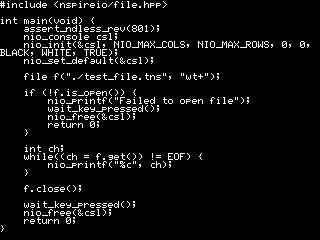
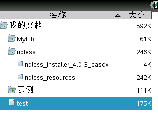
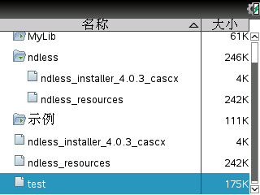
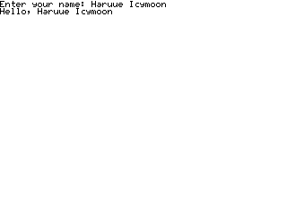

## 20160106

### 文件操作

1. 使用 C 的方法操作文件，这个与 C 很相似，__不需要__包含其他头文件，略去。    

2. 包含 C++ 的相关头文件然后用 C++ 的方法操作文件，这样可以很方便地使用标准 C++ 的各种类型（如`string`类），但是会导致程序变大（一个 Hello World 都比 Ndless 安装包大多了），而且标准 C++ 的流与 Ndless 特有的流（`file`与`console`以及其他`nio::ios_base`的派生类）不兼容，因此__不要使用__这种方法。

3. 使用`nspireio/file.hpp`中的`file`类操作文件    
    + `file`类可以算是标准 C++ `fstream`的一个优化实现，使用`file`类时，需要包含`nspireio/file.hpp`。如果同时包含有`nspireio/nspireio.h`，那么`nspireio/file.hpp`必须放在它的后面。
        ``` C++
        extern "C" {
            #include <nspireio/nspireio.h>
        }

        #include <nspireio/file.hpp>

        ```
    + 打开文件的方式与 C++ 类似，区别在于第二个参数需要使用 C 的形式，可以使用下面两种方式打开文件。
        ``` C++
        //在构造对象时打开文件
        file f("./test_file.tns", "wt+");

        //使用open()方法打开文件
        file f;
        f.open("./test_file.tns", "wt+");

        ```
    + 需要检查文件是否打开成功，可以使用`is_open()`方法。
        ``` C++
        if (!f.is_open()) {
            nio_printf("Failed to open file");
            wait_key_pressed();
            nio_free(&csl);
            return 0;
        }

        ```
    + 通过`tellp()`与`seekp()`方法可以获取文件指针的位置或者移动文件指针。
        ``` C++
        int tellp();  //获取当前指针位置
        void seekp(int pos);  //移动文件指针到相对于文件头的 pos 位置
        void seekp(int off, seekdir way);  //与 fseek 类似，选定参照移动指针
        // seekdir 是一个枚举类型
        enum seekdir
        {
            beg = SEEK_SET,
            cur = SEEK_CUR,
            end = SEEK_END
        };

        ```
        
    + 使用`get()`函数读文件的方法    
        ``` C++
        virtual int get();  //获取FILE指针当前指向的字符，返回ASCII值
        virtual void get(int& c);  //获取FILE指针当前指向的字符，将ASCII值存入c
        virtual void get(char* s, streamsize n);  //从文件第一行读入n个字符
        virtual void getline(char* s, streamsize n);  //从文件第一行读入n个字符

        ```
        示例：读取文件的所有内容并输出到 console    
        ``` C++
        #include <libndls.h>

        extern "C" {
            #include <nspireio/nspireio.h>
        }

        #include <nspireio/file.hpp>

        int main(void) {
            assert_ndless_rev(801);
            nio_console csl;
            nio_init(&csl, NIO_MAX_COLS, NIO_MAX_ROWS, 0, 0, BLACK, WHITE, TRUE);
            nio_set_default(&csl);
    
            file f("./test_file.tns", "wt+");

            if (!f.is_open()) {
                nio_printf("Failed to open file");
                wait_key_pressed();
                nio_free(&csl);
                return 0;
            }

            int ch;
            while((ch = f.get()) != EOF) {
                nio_printf("%c", ch);
            }

            f.close();

            wait_key_pressed();
            nio_free(&csl);
            return 0;
        }

        ```
        本例使用的`test_file.tns`内容为本例源代码，运行结果    
        

    + 使用`put`, `write`函数写文件的方法
        ``` C++
        virtual void put(char ch);  //将一个字符输出到文件
        virtual void write(const char* s, streamsize n);  //将字符串 s 输出到文件，流大小为 n 
        virtual void flush();  //清空缓冲区

        ```
        __注意：__`"wt+"`类方法打开的文件，如果文件已存在，并不会把原文件删去并新建文件。
    + 使用流运算符，详细参照[ console 流操作](#console-流操作)
        ``` C++
        f << "Hello World";
        f >> i;

        ```
        
4. 使用`file_each()`函数操作文件
    + 函数原型
        ``` C++
        int file_each(const char *folder, int (*callback)(const char *path, void *context), void *context);

        ```
        + 遍历`folder`，对每个文件调用`callback`函数，给`callback`函数传入两个参数，其中`path`是文件的绝对路径，传入的`context`就是`file_each`的第三个参数。     
        + `callback`函数的返回值不会影响`file_each`函数。
    + 示例：将 `/documents/ndless` 文件夹下面的所有文件复制到 `/documents`
        ``` C++
        #include <libndls.h>

        extern "C" {
            #include <nspireio/nspireio.h>
        }
        
        int copy(const char *path, void *context); 
        void getFilename(char *filename, const char *path);
        
        int main(void) {
            assert_ndless_rev(801);
            nio_console csl;
            nio_init(&csl, NIO_MAX_COLS, NIO_MAX_ROWS, 0, 0, BLACK, WHITE, TRUE);
            nio_set_default(&csl);
            
            int (*callback)(const char *path, void *context);  //回调函数指针
            callback=copy;  //回调函数指针赋值
            file_each(NDLESS_DIR, callback, NULL);
        
            wait_key_pressed();
            nio_free(&csl);
            return 0;
        }
        
        int copy(const char *path, void *context) {
            nio_printf("%s\n", path);
            //取得文件名
            char *filename = new char[20];
            getFilename(filename, path);
            //打开文件
            FILE *src, *dst;
            if((src = fopen(path, "rt+")) == NULL || (dst = fopen(filename, "wt+")) == NULL) {
                nio_printf("Failed to open file\n");
                wait_key_pressed();
                return 0;
            }
        
            delete filename;
            //复制内容
            int ch;
            while ((ch = fgetc(src)) != EOF) {
                fputc(ch, dst);
            }
        
            fclose(src);
            fclose(dst);
            return 0;
        }
        
        void getFilename(char *filename, const char *path) {
            while (*path) path++;
            while (*path != '/') path--;
            path++;
            while (*filename++ = *path++);
        }
        
        ```
        编译该程序，放到计算器中运行。然后，按`ON`键，再重新打开[我的文档]，可以看到文件已经被复制。    
        
            
        __注意：__ 1. 直接使用不带目录的文件名，将视为对`/documents/[文件名]`进行操作，无论执行的程序被放在何处。 2. 对不存在的目录里的文件进行的操作无效，即使是`"w+"`，也不会新建目录或文件。    

5. 使用`remove()`函数删除文件
    + 这是一个 C 库函数，只需要包含了`libndls.h`即可直接使用。函数原型
        ``` C++ 
        int remove(char *filename);

        ```
        传入文件名作为参数即可，成功返回`0`，失败返回`-1`。
    + 示例：写一个可以删除指定文件的程序
        ``` C++ 
        #include <libndls.h>
    
        int main(void) {
            assert_ndless_rev(801);
    
            char *filename = (char *)malloc(sizeof(char) * 50);
            int length = show_msg_user_input("Input file name to remove", "File name:", "", &filename);    
    
            if (length == -1) return 0;
    
            if (remove(filename) == 0) {
                show_msgbox("OK", "删除成功");
            } else {
                show_msgbox("Failed", "删除失败");
            }
    
            return 0;
        }
    
        ```

###  console 流操作
1. Ndless 包含有一个优化的流控制基类，定义于`nspireio/ios_base.hpp`与`nspireio/ios_base.ipp`，使用它们编译出来的可执行文件比使用标准 C++ 的流编译出来的可执行文件小很多。但是由于基类不一样，所以标准 C++ 的类，涉及到流操作重载的，与 Ndless 的这套流并__不兼容__，如标准 C++ 的`string`类，不能直接使用流操作输出到`nspireio`里定义的流上。
2. 与 console 相关的流定义于`nspireio/console.hpp`，需要使用时直接包含此文件即可。
    ``` C++
    #include <nspireio/console.hpp>

    ```
3. 使用 console 流之前，需要先实例化`console`类，`console`类有两个构造函数，分别与`nspireio/nspireio.h`中的`nio_init()`和`nio_load()`相对应。
    ``` C++
    console(const int size_x = MAX_COLS, const int size_y = MAX_ROWS, const int offset_x = 0, const int offset_y = 0, enum color background_color = COLOR_WHITE, enum color foreground_color = COLOR_BLACK, const bool drawing_enabled = true);
    console(const char* path);

    ```
    + 第一个构造函数的参数与`nio_init()`函数基本的参数基本一致，默认参数产生的是一个全屏幕__白底黑字__的 console 。
    + 第二个构造函数的参数与`nio_load()`的基本一致。
4. 实例化`console`类之后，就可以像标准 C++ 一样对 console 输入输出了。
    ``` C++
    console csl;
    char *name = new char[20];
    //输入与输出都使用 csl
    csl << "Enter your name: ";
    csl >> name;
    csl << "Hello, " << name << endl;
    delete name;

    ```
    运行效果    
          
    你还可以定义两个宏来使 C++ 程序更加方便地移植到 Ndless :-)
    ``` C++
    #define cin csl
    #define cout csl

    cout << "Enter your name: ";
    cin >> name;
    cout << "Hello, " << name << endl;

    ```

5. 示例：第一次打开程序时提示输入姓名，并保存在一个文件里，后面每次打开程序时显示问候语。    
    ``` C++
    #include <libndls.h>
    #include <nspireio/console.hpp>
    #include <nspireio/file.hpp>
    
    int main(void) {
        assert_ndless_rev(801);
    
        console csl;
        file f("./name_save.tns", "wt+");
        char *name = new char[20];
    
        f >> name;    
        //如果文件为空，则读取到的第一个字符的 ASCII 为 8 (Why?)
        if (*name == 8) {
            csl << "Enter your name: ";
            csl >> name;
            f << name << endl;
        }
    
        csl << "Hello, " << name << endl;
    
        delete name;
        f.close();
        wait_key_pressed();
        return 0;
    }


    ```

### 疑问
1. 为什么当文件不存在或为空时使用`"wt+"`的方法进行读取，会取得一个 ASCII 值为`8`的字符`\b`？
2. `"wt+"`打开的文件写入时是如何覆盖的？
3. `file::get(char* s, streamsize n);`与`file::getline(char* s, streamsize n)`有什么区别？
4. 如何操作目录？