## 20160107

### LCD 操作 - 通过显存地址
参考 http://www.cncalc.org/thread-9781-1-1.html

1. `libndls.h`中包含了一个宏，把`SCREEN_BASE_ADDRESS`定义为显存首地址，通过指针操作就可以直接对 Nspire 显存进行修改。
2. 绘制范围，在`libndls.h`中定义了`SCREEN_WIDTH`与`SCREEN_HEIGHT`来表示屏幕宽度和屏幕高度，单位为像素，那么绘制范围就是
    ``` C++ 
    0 <= x && x < SCREEN_WIDTH && 0 <= y && y < SCREEN_HEIGH

    ```
    __注意：__对绘制范围以外的像素点上色（对这部分内存赋值）将导致计算器直接重启！    
    为了避免这种情况，在绘制之前最好对绘制范围进行检查，这个检查可以内置到下面即将写到的`setpixel`函数中
    ``` C++ 
    if (x < 0 || x >= SCREEN_WIDTH || y < 0 || y >= SCREEN_HEIGHT) return -1;

    ```
3. 彩屏机和黑白屏机的差异性：
    + 对于彩屏机， Nspire 使用 16 位二进制数来表示一个颜色， 0b<font color="#F00">RRRRR</font><font color="#0F0">GGGGGG</font><font color="#00F">BBBBB</font> ，红 5 位，绿 6 位，蓝 5 位，这种颜色表示方法被称为 [16-bit high color](https://en.wikipedia.org/wiki/High_color#16-bit_high_color) ，一般来说，为了能像平常一样用 0~255 的数值表示一种颜色，可以写一个宏。
        ``` C++ 
        #define RGB16(r,g,b) (((unsigned short)(r >> 3)) << 11 | ((unsigned short)(g >> 2)) << 5 | ((unsigned short)(b >> 3)))

        ```
        这样，就可以使用`RGB16(255, 0, 0)`来表示红色了。    
        这意味着彩屏机使用两个字节来表示一个像素，给对应内存进行赋值即可给这些像素上色，为了方便，我们可以设计一个`setpixel`函数，由于`unsigned short`型就是占用两个字节，因此只需要强制类型转换一下指针就可以直接赋值了。
        ``` C++ 
        int setpixel(int x, int y, unsigned short color) {
            if (x < 0 || x >= SCREEN_WIDTH || y < 0 || y >= SCREEN_HEIGHT) return -1;
            volatile unsigned char *ptr = (volatile unsigned char *) SCREEN_BASE_ADDRESS;
            ptr += y * SCREEN_WIDTH * sizeof(short) + x * sizeof(short);
            *(volatile unsigned short *) ptr = color;
            return 0;
        }

        ```
    + 对于黑白屏， Nspire 使用单个字节表示两个像素，即 4 位表示一个像素，`0x0`表示黑色，`0xF`表示白色，中间值表示黑到白的渐变颜色（ 16 级渐变）。因此一个字节表示两个像素点，`[px1][px2]`。如果需要写一个适用于黑白机的描点函数，那么对于每个字节，就需要使用下面的半保留赋值的办法，`setpixel_wb`函数就应该这样写了。
        ``` C++ 
        int setpixel_wb(int x, int y, unsigned char color) {
            if (x < 0 || x >= SCREEN_WIDTH || y < 0 || y >= SCREEN_HEIGHT) return -1;
            volatile unsigned char *p = (volatile unsigned char *) SCREEN_BASE_ADDRESS + (x >> 1) + (y << 7) + (y << 5);
            *p = (x & 1) ? ((*p & 0xf0) | color) : ((*p & 0x0f) | (color << 4));
            return 0;
        }

        ```

    + 彩屏与黑白屏的判断： Ndless 提供了一个`has_colors`来判断是黑白屏还是彩屏，以便对黑白屏与彩屏分开处理。
        ``` C++ 
        if (has_colors) {
            // Codes for CX
        } else {
            // Codes for WB
        }

        ```
4. 相关常量： Ndless 在`libndls.h`中定义了一些宏常量来方便我们的操作
    ``` C++ 
    //屏幕宽高(px)
    #define SCREEN_WIDTH            320
    #define SCREEN_HEIGHT           240

    //黑白颜色
    #define BLACK                   0x0
    #define WHITE                   0xF

    //显存地址的总长度
    #define SCREEN_BYTES_SIZE       ((int)(_scrsize()))

    //显存首地址
    #define SCREEN_BASE_ADDRESS     (*reinterpret_cast<void**>(0xC0000010))

    ```
5. 实例：绘制三色屏    
    ``` C++
    #include <libndls.h>
    
    #define RGB16(r,g,b) (((unsigned short)(r >> 3)) << 11 | ((unsigned short)(g >> 2)) << 5 | ((unsigned short)(b >> 3)))
    
    int setpixel(int x, int y, unsigned short color) {
        if (x < 0 || x >= SCREEN_WIDTH || y < 0 || y >= SCREEN_HEIGHT) return -1;
        volatile unsigned char *ptr = (volatile unsigned char *) SCREEN_BASE_ADDRESS;
        ptr += y * SCREEN_WIDTH * sizeof(short) + x * sizeof(short);
        *(volatile unsigned short *) ptr = color;
        return 0;
    }
    
    int setpixel_wb(int x, int y, unsigned char color) {
        if (x < 0 || x >= SCREEN_WIDTH || y < 0 || y >= SCREEN_HEIGHT) return -1;
        volatile unsigned char *p = (volatile unsigned char *) SCREEN_BASE_ADDRESS + (x >> 1) + (y << 7) + (y << 5);
        *p = (x & 1) ? ((*p & 0xf0) | color) : ((*p & 0x0f) | (color << 4));
        return 0;
    }
    
    int main(void) {
        assert_ndless_rev(801);
    
        unsigned short color = BLACK;
    
        for (int x = 0; x < SCREEN_WIDTH; x++) {
            for (int y = 0; y < SCREEN_HEIGHT; y++) {
                if (y < SCREEN_HEIGHT / 3.0) color = has_colors ? RGB16(255, 0, 0) : 0x1;
                else if (y >= SCREEN_HEIGHT / 3.0 && y < SCREEN_HEIGHT * 2.0 / 3.0) color = has_colors ? RGB16(0, 255, 0) : 0x2;
                else if (y >= SCREEN_HEIGHT * 2.0 / 3.0) color = has_colors ? RGB16(0, 0, 255) : 0x3;
                has_colors ? setpixel(x, y, color) : setpixel_wb(x, y, (unsigned char) color);
            }
        }
    
        wait_key_pressed();
        return 0;
    }

    ```
    运行结果（在 firebird 上）：    
    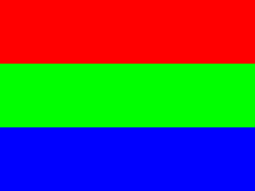
    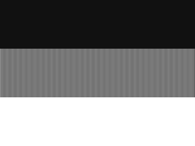

    __调试警告：__ firebird 的黑白屏与实际有差异， firebird 黑白屏只有 8 级灰度，`0x0`和`0x7`都显示为黑，`0x8`和`0xF`都显示为白，中间的依次对应渐变。这对`nGC`和`nSDL`均有影响，因此对于黑白机的显示效果， firebird 的显示效果可能会很差，建议以实际机器运行为准。    
    例如，同样的一副位图，使用`nSDL`绘制时。    
    + firebird 上，彩屏机和黑白机显示效果    
        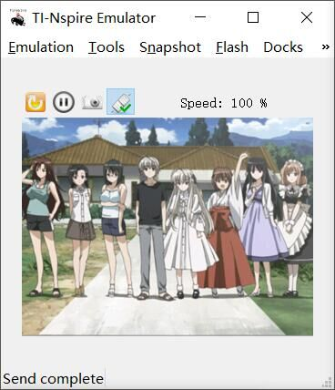
        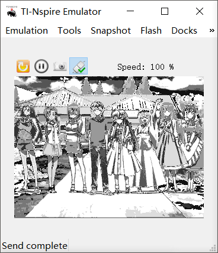
    + 实际 TI-Nspire CAS 显示效果    
        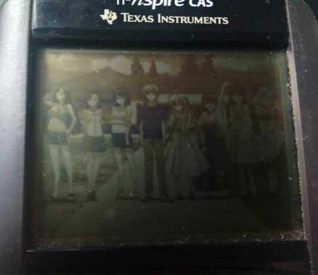

    由于运行 Ndless 程序时无法连接 USB ，因此 NdlessNote 中的大部分程序截图使用的都是 firebird 效果，建议在实体机上运行程序以查看真实结果。

6. 优化：上述操作都是直接针对显存的，因此用户可以看到一个绘制的过程，有时候我们并不希望用户看到这一过程，因此可以先分配一块内存，用那块内存进行绘制，然后再`memcpy`到显存里去。    
    为了实现这一点，我们可以写几个函数
    ``` C++ 
    //在一块内存中绘图
    int setpixel_to_block(void *block, int x, int y, unsigned short color) {
        if (x < 0 || x >= SCREEN_WIDTH || y < 0 || y >= SCREEN_HEIGHT) return -1;
        volatile unsigned char *ptr = (volatile unsigned char *) block;
        ptr += y * SCREEN_WIDTH * sizeof(short) + x * sizeof(short);
        *(volatile unsigned short *) ptr = color;
        return 0;
    }
    
    int setpixel_to_block_wb(void *block, int x, int y, unsigned char color) {
        if (x < 0 || x >= SCREEN_WIDTH || y < 0 || y >= SCREEN_HEIGHT) return -1;
        volatile unsigned char *p = (volatile unsigned char *) block + (x >> 1) + (y << 7) + (y << 5);
        *p = (x & 1) ? ((*p & 0xf0) | color) : ((*p & 0x0f) | (color << 4));
        return 0;
    }
    
    //将当前显存内容复制到一块内存中
    int get_screen_block(void *block) {
        memcpy(block, (void *) SCREEN_BASE_ADDRESS, SCREEN_BYTES_SIZE);
        return 0;
    }
    
    //将一块内存中的内容填充到显存
    int blit_block_to_screen(void *block) {
        memcpy((void *) SCREEN_BASE_ADDRESS, block, SCREEN_BYTES_SIZE);
        return 0;
    }
    
    ```
    绘制的时候这样写
    ``` C++
    void *block = (void *)malloc(SCREEN_BYTES_SIZE);
    get_screen_block(block);

    unsigned short color = BLACK;

    for (int x = 0; x < SCREEN_WIDTH; x++) {
        for (int y = 0; y < SCREEN_HEIGHT; y++) {
            if (y < SCREEN_HEIGHT / 3.0) color = has_colors ? RGB16(255, 0, 0) : 0x1;
            else if (y >= SCREEN_HEIGHT / 3.0 && y < SCREEN_HEIGHT * 2.0 / 3.0) color = has_colors ? RGB16(0, 255, 0) : 0x2;
            else if (y >= SCREEN_HEIGHT * 2.0 / 3.0) color = has_colors ? RGB16(0, 0, 255) : 0x3;
            has_colors ? setpixel_to_block(block, x, y, color) : setpixel_to_block_wb(block, x, y, (unsigned char) color);
        }
    }

    blit_block_to_screen(block);

    ```
    最终效果与之前一致，但是用户看不到绘图过程了。

### 使用`nGC`绘制图形用户界面
1. Ndless 带有一个图形界面设计工具，存在于`ngc.h`，只需要包含了`libndls.h`就可以直接使用它们了。
2. 使用`nGC`，必须先定义一个`gc`然后初始化。
    ``` C++
    Gc gc = gui_gc_global_GC();
    gui_gc_begin(gc);

    ```
3. `nGC`并不会将绘制的东西立即输出到屏幕上，而是在完成所有设计之后，使用如下语句，才会将界面绘制出来。
    ``` C++ 
    gui_gc_finish(gc);  //让 gc 不再改变
    gui_gc_blit_to_screen(gc);  //将 gc 绘制到屏幕上

    ```
    当然，你也可以直接使用`gui_gc_blit_to_screen`函数，但是可能会导致异常。 
4. `nGC`提供了大量的图形绘制函数，一般的设计思路是先设置属性，然后绘制图形。    
    示例：在屏幕上绘制一个矩形
    ``` C++
    gui_gc_setColorRGB(gc, 255, 0, 0);
    gui_gc_drawRect(gc, 20, 20, 100, 100);

    ```
    效果    
    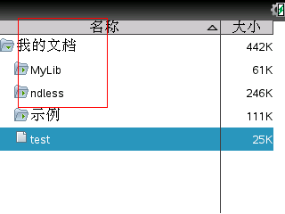    
    示例：在屏幕上填充一个半透明的矩形
    ``` C++ 
    gui_gc_setColorRGB(gc, 255, 0, 0);
    gui_gc_setAlpha(gc, GC_A_HALF);
    gui_gc_fillRect(gc, 20, 20, 100, 100);

    ```
    效果    
    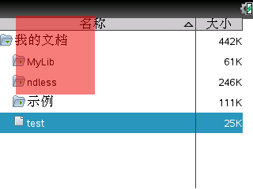     
    即使是黑白屏幕，也可以展现出半透明的效果，但是在第一次显示的时候会有 BUG ，透明区域会以反色显示    
    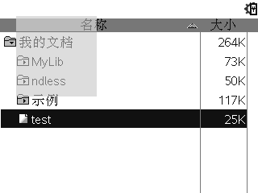     
    __BUG 警告：__透明度可能会改变，通常情况下是随调用次数的增多而越来越深，这可能是导致黑白屏第一次显示反色的原因。

5. 使用`gui_gc_drawString`绘制字符串    
    + `nGC`提供了一个字符串绘制函数以方便我们绘制字符串，它的函数原型如下
        ``` C++
        void gui_gc_drawString(Gc gc, char *utf16, int x, int y, gui_gc_StringMode mode);

        ```
    + 第二个参数需要我们传入一个`utf16`字符串，这是不太方便的地方，即使是ASCII字符，我们也需要在每个字符后面加一个`\0`，并在字符串结束时额外加一个`\0`，就像这样
        ``` C++ 
        gui_gc_drawString(gc, "R\0e\0g\0u\0l\0a\0r\0001\0002\0\0", 30, 40, GC_SM_NORMAL);

        ```
        _\*在下一篇笔记中将会摒弃这种极其不方便的使用`utf8`字符串来构造`utf16`的方法，甚至还可以直接显示中文。_
    + 字符串的显示是使用了 Nspire 自带的方式，在不同版本的系统上显示效果可能会有区别，为了获得实际字体的显示效果，我们可以写这样一个程序。    
        测试程序：使用`nGC`绘制各种字体的字符串
        ``` C++ 
        #include <libndls.h>
        
        int main(void) {
            assert_ndless_rev(801);
        
            Gc gc = gui_gc_global_GC();
            gui_gc_begin(gc);
            //在屏幕上填充一个白色矩形作为背景
            gui_gc_setColorRGB(gc, 255, 255, 255);
            gui_gc_fillRect(gc, 0, 0, SCREEN_WIDTH - 1, SCREEN_HEIGHT - 1);
            //绘制字符串
            gui_gc_setColorRGB(gc, 0, 0, 0);
            gui_gc_setFont(gc, Regular12);
            gui_gc_drawString(gc, "R\0e\0g\0u\0l\0a\0r\0001\0002\0\0", 30, 40, GC_SM_NORMAL);
            gui_gc_setFont(gc, Bold12);
            gui_gc_drawString(gc, "B\0o\0l\0d\0001\0002\0\0", 30, 60, GC_SM_NORMAL);
            gui_gc_setFont(gc, Italic12);
            gui_gc_drawString(gc, "I\0t\0a\0l\0i\0c\0001\0002\0\0", 30, 80, GC_SM_NORMAL);
            gui_gc_setFont(gc, BoldItalic12);
            gui_gc_drawString(gc, "B\0o\0l\0d\0I\0t\0a\0l\0i\0c\0001\0002\0\0", 30, 100, GC_SM_NORMAL);
            gui_gc_setFont(gc, SerifRegular12);
            gui_gc_drawString(gc, "S\0e\0r\0i\0f\0R\0e\0g\0u\0l\0a\0r\0001\0002\0\0", 30, 120, GC_SM_NORMAL);
            gui_gc_setFont(gc, SerifBold12);
            gui_gc_drawString(gc, "S\0e\0r\0i\0f\0B\0o\0l\0d\0001\0002\0\0", 30, 140, GC_SM_NORMAL);
            gui_gc_setFont(gc, SerifItalic12);
            gui_gc_drawString(gc, "S\0e\0r\0i\0f\0I\0t\0a\0l\0i\0c\0001\0002\0\0", 30, 160, GC_SM_NORMAL);
            gui_gc_setFont(gc, SerifBoldItalic12);
            gui_gc_drawString(gc, "S\0e\0r\0i\0f\0B\0o\0l\0d\0I\0t\0a\0l\0i\0c\0001\0002\0\0", 30, 180, GC_SM_NORMAL);
        
            gui_gc_finish(gc);
            gui_gc_blit_to_screen(gc);
        
            wait_key_pressed();
            return 0;
        }

        ```
        显示效果：    
        + TI-Nspire CX CAS, OS 4.0.3.29    
            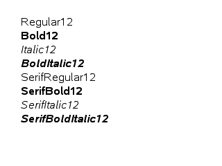
        + TI-Nspire CAS, OS 3.1.0.392    
            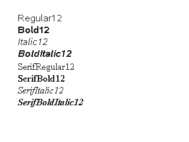    
    虽然写的字体是`Serif`，但是在 OS 4.0 上显示时完全没有衬线，甚至和`Sans-Serif`系列一模一样。    
    __BUG 警告：__就像上面提到的一样，实际显示字体效果可能和你设置的并不一样，另外，如果使用下一篇笔记的方法输出中文，由于 Nspire 上自带的只有一种中文字体，那么最终效果只会是那种字体。

6. 梯度填充    
    + `nGC`可以使用`gui_gc_fillGradient`来对一个矩形区域进行梯度填充，函数原型如下
        ``` C++ 
        void gui_gc_fillGradient(Gc, int x, int y, int w, int h, int start_color, int end_color, int vertical);

        ```
    + `vertical` - `0`表示水平，`1`表示竖直
    + 在这个函数中，我们可以直接使用我们熟悉的十六进制颜色表示方式`0xRRGGBB`    
        示例：在屏幕上梯度填充一个矩形
        ``` C++
        gui_gc_fillGradient(gc, 0, 0, SCREEN_WIDTH - 1, SCREEN_HEIGHT - 1, 0xFFFFFF, 0x000000, 1);

        ```
        彩屏和黑白屏的效果分别如下所示（黑白屏效果受到 firebird 只有 8 级灰度的影响，实际效果可以从左到右正常地显示 16 级灰度）：    
        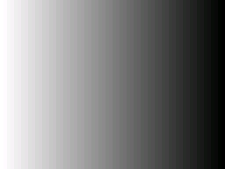
        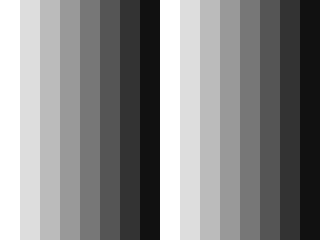    
        但是如果是彩色，那么就会有十分明显的 BUG 。
        ``` C++ 
        gui_gc_fillGradient(gc, 0, 0, SCREEN_WIDTH - 1, SCREEN_HEIGHT - 1, 0xFF0000, 0x00FF00, 1);

        ```
        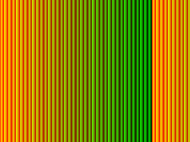
        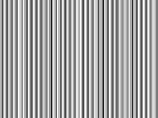    
        ~~简直不能看~~    
        __BUG 警告：__实际显示效果可能和你设定的有很大的差别，因此，尽量只使用这个函数进行黑白梯度填充。    
