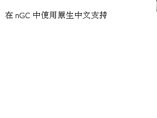

## 20160108

### 在`nGC`中使用原生中文支持

1. `nGC`提供的`gui_gc_drawString`要求第二个参数必须是`utf16`， GCC 中的`wchar_t`默认是 32 位宽字符，所以首先应该修改`Makefile`，在`GCCFLAGS`中加入`-fwide-exec-charset=UTF-16LE`，把`wchar_t`修改成默认`UTF-16`。
    ``` Makefile
    GCCFLAGS += -fwide-exec-charset=UTF-16LE
    
    ```   
    然后就可以直接使用`gui_gc_drawString`绘制中文了
    ``` C++ 
    gui_gc_drawString(gc, (char *)L"在 nGC 中使用原生中文支持", 10, 40, GC_SM_NORMAL);

    ```
    效果    
    
    