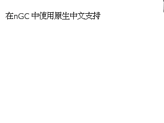

## 20160108

### 在`nGC`中原生中文支持的尝试

1. `nGC`提供的`gui_gc_drawString`要求第二个参数必须是`utf16`， GCC 中的`wchar_t`是 32 位宽字符，我们把`wchar_t`强制类型转换一下传进去试试。
    ``` C++ 
    gui_gc_drawString(gc, (char *)L"在 nGC 中使用原生中文支持", 10, 40, GC_SM_NORMAL);

    ```
    效果    
        
    只显示出了第一个字，看来 32 位的分隔被直接当作结束了，不过，如果只是设计 GUI 的话，也足够了。因为我们可以这样：
    ``` C++ 
    gui_gc_drawString(gc, (char *)L"在", 10, 40, GC_SM_NORMAL);
    gui_gc_drawString(gc, (char *)L"n", 27, 40, GC_SM_NORMAL);
    gui_gc_drawString(gc, (char *)L"G", 35, 40, GC_SM_NORMAL);
    gui_gc_drawString(gc, (char *)L"C", 47, 40, GC_SM_NORMAL);
    gui_gc_drawString(gc, (char *)L"中", 60, 40, GC_SM_NORMAL);
    gui_gc_drawString(gc, (char *)L"使", 75, 40, GC_SM_NORMAL);
    gui_gc_drawString(gc, (char *)L"用", 90, 40, GC_SM_NORMAL);
    gui_gc_drawString(gc, (char *)L"原", 105, 40, GC_SM_NORMAL);
    gui_gc_drawString(gc, (char *)L"生", 120, 40, GC_SM_NORMAL);
    gui_gc_drawString(gc, (char *)L"中", 135, 40, GC_SM_NORMAL);
    gui_gc_drawString(gc, (char *)L"文", 150, 40, GC_SM_NORMAL);
    gui_gc_drawString(gc, (char *)L"支", 165, 40, GC_SM_NORMAL);
    gui_gc_drawString(gc, (char *)L"持", 180, 40, GC_SM_NORMAL);

    ```
    效果    
        
    ~~简直丧心病狂~~    
    如果使用`gui_gc_getStringWidth`, `gui_gc_getStringHeight`这样的函数的话，写起程序来会方便很多吧。。。不过使用起来同样不方便，而且有些用途也难以实现。。。    

    所以，还是继续研究吧。
